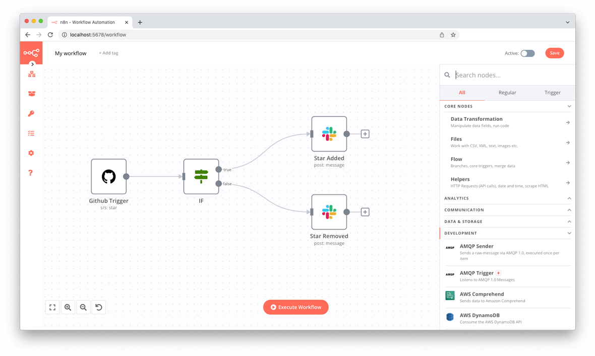

# sample-app-n8n

[n8n](https://n8n.io/) is an extendable workflow automation tool similar to hosted service like IFTTT and Zapier. n8n is available to self-host, and allows you to add your own custom functions, logic and apps. n8n's node-based approach makes it highly versatile, enabling you to connect anything to everything.



This repository provides documentation on how to host this app on SetOps. If you want to deploy the app yourself, use the image referenced below. Apps created from a SetOps stage template use this image, too.

```
docker pull ghcr.io/setopsco/sample-app-n8n:latest`
```

> **Copyright Note**
> n8n GmbH is owner of the name *n8n*, logos and the screenshot above. This repository just uses these resources and the software of n8n GmbH to showcase how to deploy such an application to SetOps (on AWS).

## What to try

1. Deploy the app as a sample app from the [SetOps Web UI](https://app.setops.co). You can select it from the list of sample apps when you create a stage.

1. Wait until the stage is created and the progress bar disappears. Click on the stage and select the *web* app.

1. Make yourself comfortable with the app status dashboard and the information it tells you about the current state of your app.

1. Visit the app by clicking on `Visit Website`.

1. It will ask for basic auth credentials (defaults set in sample apps):

    ```
    Username: setops
    Password: setops
    ```

1. You can complete the account creation and follow the *Get started faster* video which should be displayed in the first workflow.

## Components

* **App:** There is one single app *n8n* which is a modified version of the official Docker image `n8nio/n8n` to make it run on SetOps.

* **Services:** The app requires two services:
  * A persistent datastore to store application data. SetOps volumes are used for this data which are mounted into the container.
  * A database. SQLite could be used but for better performance the SetOps PostgreSQL service is used.

## Creating the app

> **Note**
> These are the steps you need to follow to manually create the app in SetOps. You can use a stage template on the web UI to do this in one step.

1. Create the stage: `setops -p samples stage:create n8n`

1. Create the app: `setops -p samples -s n8n app:create web`

1. Create the volume service: `setops -p samples -s n8n service:create storage --type volume`

1. Create the PostgreSQL service with a shared plan: `setops -p samples -s n8n service:create database --type postgresql11 --plan shared`

1. Configure the app:

   ```
   setops -p samples -s n8n --app web container:set health-check --timeout 30 --interval 60 -- /bin/sh -c 'curl -s http://localhost:$PORT/healthz | grep ok'
   setops -p samples -s n8n --app web network:set health-check-path /healthz
   setops -p samples -s n8n --app web network:set public true
   setops -p samples -s n8n --app web network:set port 5678
   setops -p samples -s n8n --app web resource:set cpu 128

   # n8n requires a minimum of 512 MB of memory to start.
   # Depending on your workflow, it might require more.
   # You will notice that your webserver becomes unavailable when it runs out of memory
   # and the logs will say:
   # > Task status is DEPROVISIONING, desired status is STOPPED due to 'Essential container in task exited'
   setops -p samples -s n8n --app web resource:set memory 512
   ```

1. Link the service to the app so that they can be used by n8n:

  ```
  setops -p samples -s n8n --app web link:create storage --path /home/node/.n8n
  setops -p samples -s n8n --app web link:create database --env-key DATABASE_URL
  ```

1. Enable authentication, which is important since this app is publicly available. Replace `<USERNAME>` and `<PASSWORD>`:

  ```
  setops -p samples -s n8n --app web env:set N8N_BASIC_AUTH_ACTIVE=true
  setops -p samples -s n8n --app web env:set N8N_BASIC_AUTH_USER=<USERNAME>
  setops -p samples -s n8n --app web env:set N8N_BASIC_AUTH_PASSWORD=<PASSWORD>
  ```

1. Commit the stage: `setops -p samples -s n8n changeset:commit`

1. Push the Docker image and activate the release:

   ```
   docker pull ghcr.io/setopsco/sample-app-n8n:latest
   docker tag ghcr.io/setopsco/sample-app-n8n api.setops.co/demo/samples/n8n/web:latest
   # note the sha256:[...] digest after pushing the image and paste it in "release:create"
   setops -p samples -s n8n --app web release:create <DIGEST>
   setops -p samples -s n8n --app web release:activate 1
   setops -p samples -s n8n changeset:commit
   ```

1. Open your app and enter the basic auth credentials! :tada:

1. You can complete the account creation and follow the *Get started faster* video which should be displayed in the first workflow.
